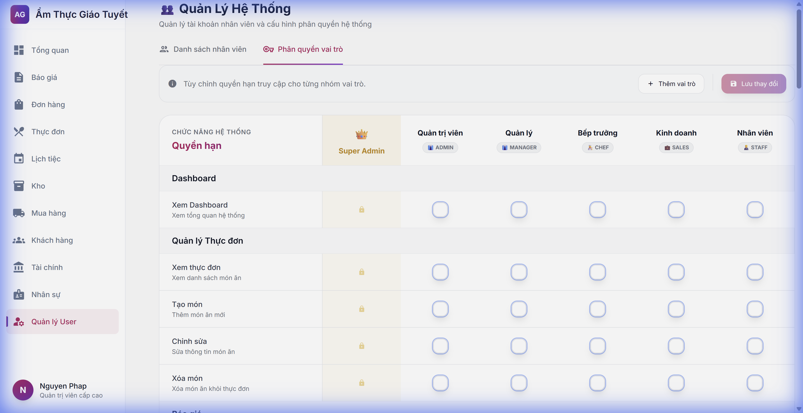

# Hướng Dẫn Sử Dụng: Phân Quyền Vai Trò

> **Module:** Quản lý Hệ thống → Phân quyền vai trò  
> **Phiên bản:** 2.0  
> **Cập nhật:** 24/01/2026

---

## 1. Giới thiệu

**Ma trận phân quyền** cho phép Admin thiết lập quyền truy cập cho từng vai trò trong hệ thống. Mỗi vai trò có thể được cấp hoặc thu hồi quyền trên từng chức năng cụ thể.

### Các vai trò trong hệ thống

| Vai trò | Mô tả |
|---------|-------|
| 👑 **Super Admin** | Toàn quyền (không thể thay đổi) |
| 👔 **Admin** | Quản trị viên hệ thống |
| 🧑‍💼 **Manager** | Quản lý cấp trung |
| 👨‍🍳 **Chef** | Bếp trưởng |
| 💼 **Kinh doanh** | Nhân viên kinh doanh |
| 🧑‍💼 **Staff** | Nhân viên thường |

---

## 2. Truy cập tính năng

1. Vào **Quản lý Hệ thống** từ menu trái
2. Chọn tab **Phân quyền vai trò**

---

## 3. Các module được phân quyền

| ID | Module | Quyền có thể cấp |
|----|--------|------------------|
| 1 | Dashboard | Xem |
| 2 | Thực đơn | Xem, Tạo, Sửa, Xóa |
| 3 | Báo giá | Xem, Tạo, Sửa, Xóa, Chuyển đơn |
| 4 | Đơn hàng | Xem, Tạo, Sửa, Xóa, Phân công |
| 5 | Lịch tiệc | Xem, Quản lý |
| 6 | Kho hàng | Xem, Điều chỉnh, Quản lý |
| 7 | Mua hàng | Xem, Tạo, Duyệt, Nhận hàng |
| 8 | Nhân sự | Xem, Quản lý, Phân ca |
| 9 | Tài chính | Xem, Hóa đơn, Thanh toán |
| 10 | Khách hàng | Xem, Thêm, Sửa, Xóa |
| 11 | Phân tích | Xem, Xuất báo cáo |
| 12 | Người dùng | Xem, Tạo, Sửa, Xóa, Phân quyền |

---

## 4. Ví dụ: Quyền của vai trò "Kinh doanh"

| Module | Quyền | Ghi chú |
|--------|:-----:|---------|
| Dashboard | ✅ Xem | Xem tổng quan |
| Thực đơn | ✅ Xem | Chỉ xem, không sửa |
| Báo giá | ✅ Full | Xem, Tạo, Sửa, Chuyển đơn |
| Đơn hàng | ✅ Giới hạn | Xem, Tạo (không Sửa/Xóa) |
| Khách hàng | ✅ Có | Xem, Thêm, Sửa |
| Phân tích | ✅ Xem | Xem báo cáo |

---

## 5. Thao tác chỉnh sửa quyền

1. **Click vào ô** tại giao điểm giữa vai trò và quyền
2. **Màu tím** = Có quyền, **Màu trắng** = Không có quyền
3. **Khóa vàng** = Quyền mặc định (không thể thay đổi)
4. Click **"Lưu thay đổi"** để áp dụng

---

## 6. FAQ

### Tại sao không thể thay đổi quyền của Super Admin?
Super Admin có toàn quyền mặc định để đảm bảo an toàn hệ thống.

### Thay đổi có hiệu lực ngay không?
Có, sau khi nhấn "Lưu thay đổi" quyền được áp dụng ngay lập tức.

### Làm sao để thêm vai trò mới?
Click **"Thêm vai trò"** ở góc phải trên, nhập tên và lưu.

---

*Tài liệu được tạo tự động bởi /auto-doc workflow*
