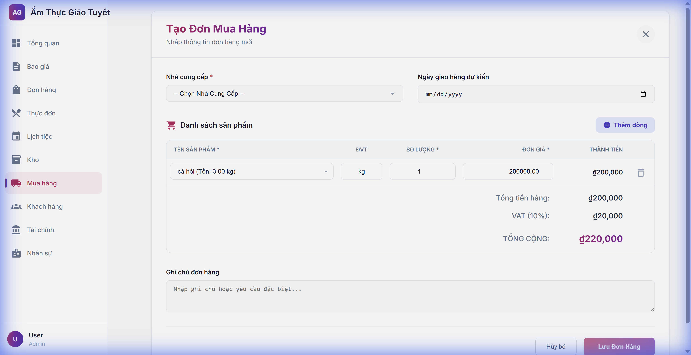
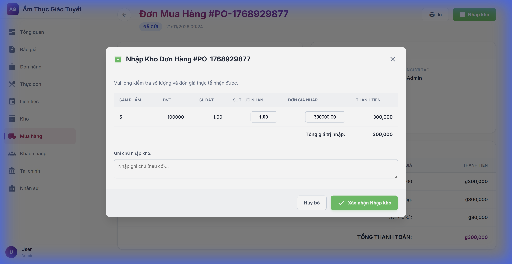
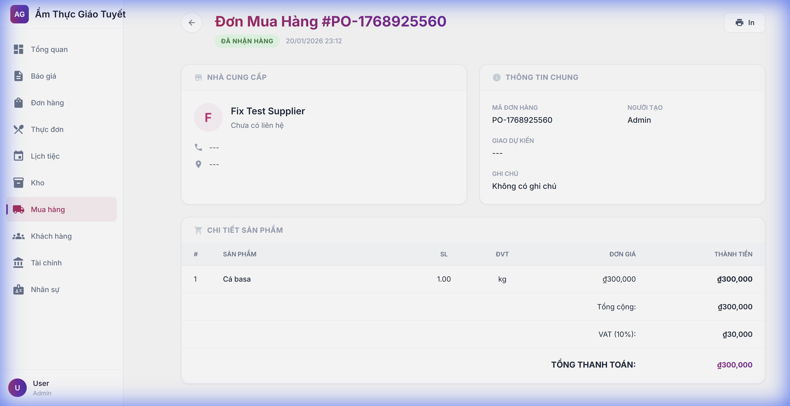
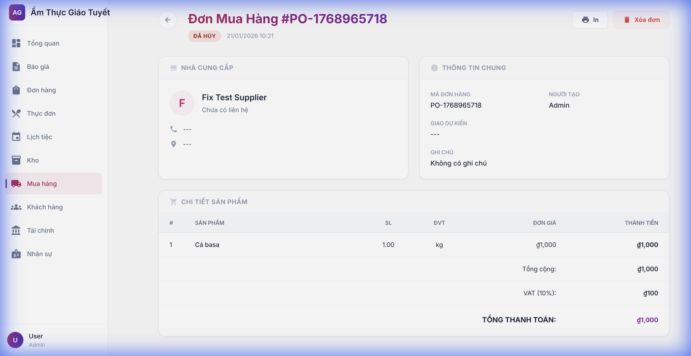
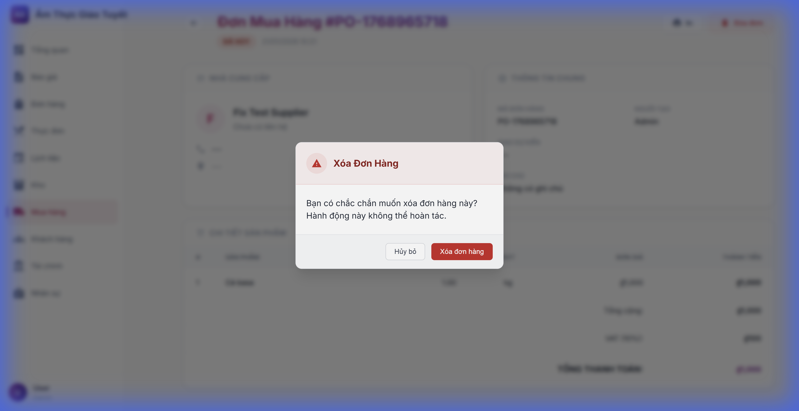

# Hướng Dẫn Sử Dụng: Mua Hàng & Nhập Kho Thông Minh

> **Phiên bản**: 1.0  
> **Ngày cập nhật**: 20/01/2026  
> **Ngôn ngữ**: Tiếng Việt

---

## 1. Giới Thiệu

### Mô tả
Module **Mua Hàng (Procurement)** phiên bản mới được liên kết chặt chẽ với **Kho Hàng (Inventory)**. Tính năng này giúp tối ưu hóa quy trình nhập hàng, giảm thiểu sai sót do nhập liệu thủ công và cung cấp công cụ "Trợ lý ảo" giúp phát hiện và bổ sung hàng hóa sắp hết một cách nhanh chóng.

### Ai sử dụng?
- **Quản lý Kho (Inventory Manager)**: Theo dõi tồn kho và tạo yêu cầu nhập hàng.
- **Nhân viên Mua hàng (Procurement Staff)**: Tạo và xử lý đơn đặt hàng với nhà cung cấp.

---

## 2. Hướng Dẫn Sử Dụng

### 2.1. Truy cập module
1. Đăng nhập vào hệ thống
2. Từ menu bên trái, chọn **Mua hàng** để xem danh sách đơn hàng hoặc **Kho** để xem tồn kho.

---

### 2.2. Nhập Hàng Tự Động Từ Cảnh Báo Tồn Kho (Replenish)
Tính năng nổi bật giúp tạo đơn mua hàng siêu tốc cho các sản phẩm đang ở mức báo động "Sắp hết" (Low Stock).

**Bước 1**: Truy cập menu **Kho**.
Hệ thống sẽ tự động đánh dấu các sản phẩm có số lượng dưới mức tối thiểu bằng biểu tượng cảnh báo màu vàng và trạng thái "Low".

**Bước 2**: Tìm sản phẩm cần nhập.
Tại cột **Actions** (Thao tác), bạn sẽ thấy nút **Nhập hàng (🛒)** chỉ xuất hiện cho các sản phẩm sắp hết.

**Bước 3**: Tạo đơn mua.
Bấm vào nút **Nhập hàng (🛒)**. Hệ thống sẽ:
- Chuyển hướng ngay đến màn hình **Tạo Đơn Mua Hàng**.
- **Tự động điền** thông tin sản phẩm đó vào dòng đầu tiên (Tên, ĐVT, Đơn giá nhập gần nhất).

---

### 2.3. Tạo Đơn Mua Hàng Thủ Công (Liên Kết Kho)
Khi tạo đơn hàng thông thường, bạn không cần gõ tay tên sản phẩm nữa.

**Bước 1**: Truy cập **Mua hàng** -> Bấm **Tạo đơn mua**.

**Bước 2**: Chọn Nhà Cung Cấp.

**Bước 3**: Chọn sản phẩm.
Tại mục "Tên sản phẩm", danh sách sổ xuống (Dropdown) sẽ hiển thị tất cả hàng hóa đang có trong kho.
- Chọn sản phẩm từ danh sách.
- Hệ thống **tự động điền** Đơn vị tính (ĐVT) và Đơn giá tham khảo.

**Bước 4**: Nhập số lượng và Lưu đơn hàng.

---

### 2.4. Nhập Kho (Smart Receive)
Khi đơn hàng đã được Gửi, bạn có thể tiến hành nhập kho trực tiếp:

1.  Tại màn hình chi tiết đơn hàng, nhấn nút **"Nhập kho"** (Màu xanh lá).
2.  Hệ thống hiển thị Modal **"Nhập Kho Đơn Hàng"**.
3.  Kiểm tra danh sách sản phẩm:
    *   **Số lượng thực nhận**: Có thể chỉnh sửa nếu nhận thiếu/dư.
    *   **Đơn giá nhập**: Có thể cập nhật theo thực tế.
    *   *Lưu ý: Các sản phẩm tự do (không có trong danh mục kho) sẽ không được tạo thẻ kho.*

    

4.  Nhập ghi chú (nếu có).
5.  Nhấn **"Xác nhận Nhập kho"**.

> [!SUCCESS]
> Hệ thống sẽ tự động tạo phiếu nhập kho và cập nhật số lượng tồn kho cho các sản phẩm liên kết.

### 2.5. Xóa Đơn Hàng (Đã Nhận)
Nếu có sai sót trong quá trình nhập kho hoặc đơn hàng bị hủy sau khi đã nhận, bạn có thể xóa đơn hàng.

1.  Tại màn hình chi tiết đơn hàng (Trạng thái **Đã nhận hàng**).
2.  Nhấn nút **"Xóa đơn"** (Màu đỏ).
3.  Hệ thống hiển thị hộp thoại xác nhận.
4.  Nhấn **"Xóa mục"** để xác nhận xóa vĩnh viễn đơn hàng.

> [!CAUTION]
> **Hành động không thể hoàn tác**: Xóa đơn hàng sẽ xóa toàn bộ thông tin đơn hàng và các chi tiết liên quan. Vui lòng kiểm tra kỹ trước khi thực hiện.

### 2.6. Xóa Đơn Hàng (Đã Hủy)
Ngoài đơn hàng đã nhập kho, bạn cũng có thể xóa các đơn hàng đã bị **Hủy** để làm sạch danh sách.

1.  Tại màn hình chi tiết đơn hàng (Trạng thái **Đã hủy**).
2.  Kiểm tra nút **"Xóa đơn"** (Màu đỏ) góc trên bên phải.
3.  Nhấn **"Xóa đơn"**.

4.  Xác nhận tại hộp thoại cảnh báo.

---

## 3. Lưu Ý Quan Trọng

> [!TIP]
> **Đơn giá tự động**: Giá được điền tự động là giá nhập gần nhất hoặc giá vốn. Bạn hoàn toàn có thể sửa lại giá này nếu nhà cung cấp có thay đổi.

> [!WARNING]
> **Dữ liệu đồng bộ**: Khi bạn chọn sản phẩm từ danh sách, hệ thống sẽ lưu `item_id`. Điều này giúp sau này bạn có thể xem lịch sử giá nhập của chính xác mặt hàng đó. Hạn chế nhập tay tên sản phẩm bên ngoài danh sách nếu không thực sự cần thiết.

---

## 4. Câu Hỏi Thường Gặp (FAQ)

### Q1: Tại sao tôi không thấy nút "Nhập hàng" (🛒) ở màn hình Kho?
**A**: Nút này chỉ xuất hiện khi sản phẩm đó có số lượng tồn kho thực tế nhỏ hơn hoặc bằng Mức tồn kho tối thiểu (`min_stock`). Hãy kiểm tra lại cài đặt `min_stock` của sản phẩm.

### Q2: Tôi có thể chọn nhiều sản phẩm cùng lúc không?
**A**: Hiện tại quy trình "Nhập hàng từ kho" hỗ trợ từng sản phẩm. Tuy nhiên, sau khi được chuyển đến trang Tạo đơn, bạn có thể bấm "Thêm dòng" để chọn thêm các sản phẩm khác từ danh sách thả xuống.

### Q3: Nếu sản phẩm chưa có trong Kho thì sao?
**A**: Bạn cần vào module **Kho** -> **Nhập kho/Thêm mới** để tạo mã sản phẩm trước (SKU, Tên, ĐVT). Sau đó sản phẩm mới sẽ xuất hiện trong danh sách khi mua hàng.

---

## 5. Liên Hệ Hỗ Trợ

Nếu bạn gặp vấn đề, vui lòng liên hệ:
- **IT Support**: admin@amthucgiaotuyet.com

---

*Tài liệu này được tạo tự động bởi AI Workforce.*
