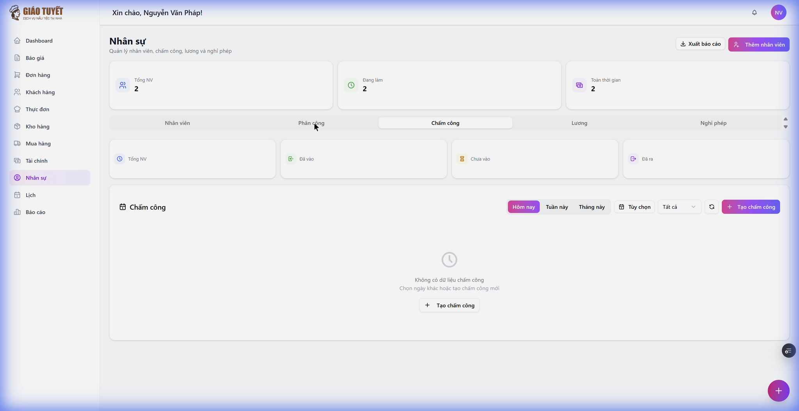
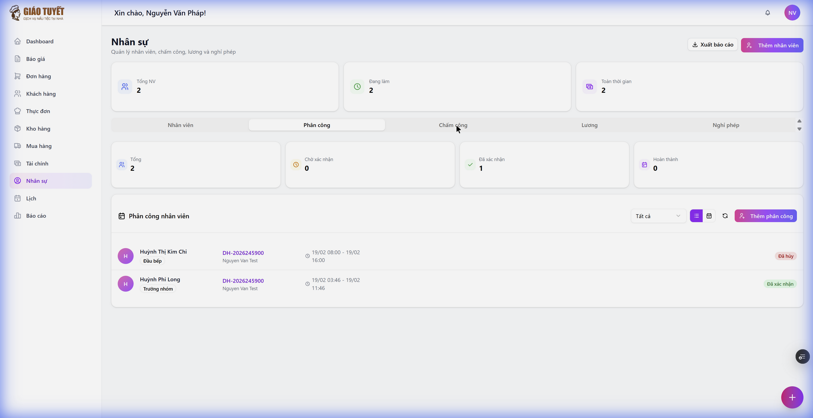

# Hướng dẫn sử dụng: Chấm công nhanh (Quick-Attendance Panel)

> **Module**: Nhân sự (HR) → Tab Chấm công
> **Ngày tạo**: 20/02/2026
> **Phiên bản**: 1.0

---

## 1. Giới thiệu

**Chấm công nhanh** là tính năng mới trong tab Chấm công, giúp manager:
- 🚀 **Không cần nhớ** ai đã được phân công hôm nay
- ⚡ **1 click** chấm vào cho từng nhân viên
- 📋 **Tạo tất cả** bản chấm công cùng lúc

### Trước đây (7 bước)
1. Mở tab Phân công → xem ai được giao
2. Ghi nhớ tên nhân viên
3. Chuyển sang tab Chấm công
4. Nhấn "Tạo chấm công" → chọn NV → chọn ngày → xác nhận
5. Lặp lại cho mỗi nhân viên

### Bây giờ (2 bước)
1. Mở tab Chấm công → thấy panel **Chấm công nhanh**
2. Nhấn **"Chấm vào"** hoặc **"Tạo tất cả"**

---

## 2. Cách sử dụng

### Bước 1: Mở tab Chấm công
Từ sidebar, chọn **Nhân sự** → click tab **Chấm công**.

### Bước 2: Xem panel Chấm công nhanh
Panel sẽ **tự động hiện** khi có nhân viên được phân công hôm nay nhưng chưa có bản chấm công.

**Thông tin hiển thị cho mỗi nhân viên:**
| Thông tin | Mô tả |
|:---|:---|
| Avatar + Tên | Tên nhân viên |
| Chức vụ | Ví dụ: Đầu bếp, Trưởng nhóm |
| Mã đơn hàng | Link đến đơn hàng liên quan |
| Địa điểm | Nơi tổ chức sự kiện |
| Giờ làm | Lịch trình từ phân công |

### Bước 3: Chấm công

**Cách 1 — Chấm từng người:**
- Nhấn nút **"Chấm vào"** (màu xanh) bên cạnh mỗi nhân viên
- Hệ thống tự động tạo bản chấm công + ghi nhận giờ vào

**Cách 2 — Chấm tất cả:**
- Nhấn nút **"Tạo tất cả"** (màu cam) ở góc phải
- Tạo bản chấm công cho toàn bộ nhân viên chưa chấm

### Bước 4: Xác nhận kết quả
- Nhân viên đã chấm sẽ **biến mất** khỏi panel
- Panel **tự ẩn** khi tất cả đã được chấm
- Bản chấm công mới xuất hiện trong danh sách bên dưới

---

## 3. Tab Phân công (Nguồn dữ liệu)

Panel Chấm công nhanh lấy dữ liệu từ tab **Phân công**:

Nhân viên chỉ xuất hiện trong panel khi:
- ✅ Có phân công cho **ngày hôm nay**
- ✅ Status là **Đã giao** hoặc **Đã xác nhận**
- ✅ **Chưa có** bản chấm công cho ngày đó

---

## 4. FAQ

### Q: Panel không hiển thị?
**A:** Panel chỉ hiện khi có nhân viên được phân công hôm nay nhưng chưa chấm. Kiểm tra tab Phân công xem có phân công cho ngày hôm nay hay không.

### Q: Nhấn "Chấm vào" nhưng có lỗi?
**A:** Có thể bản chấm công đã tồn tại. Kiểm tra danh sách chấm công bên dưới panel.

### Q: Có thể sửa giờ chấm sau khi tạo?
**A:** Có. Click vào bản chấm công trong danh sách → di chuột qua cột giờ → nhấn icon bút chì để sửa.

### Q: "Tạo tất cả" có chấm giờ vào luôn không?
**A:** Không, nút "Tạo tất cả" chỉ tạo bản chấm công (PENDING). Để chấm giờ vào, dùng nút "Chấm vào" cho từng người hoặc chấm thủ công trong danh sách.

### Q: Dữ liệu phân công từ đâu?
**A:** Từ module **Nhân sự → Tab Phân công**. Khi bạn thêm phân công cho đơn hàng, nhân viên sẽ tự động xuất hiện trong panel Chấm công nhanh vào đúng ngày đó.
