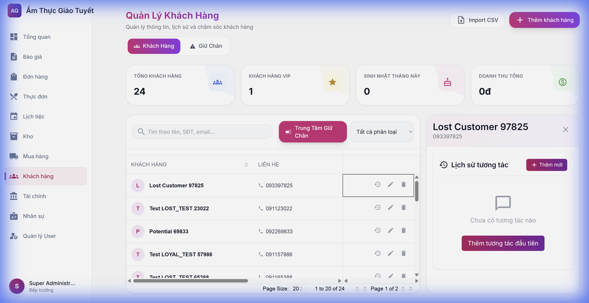
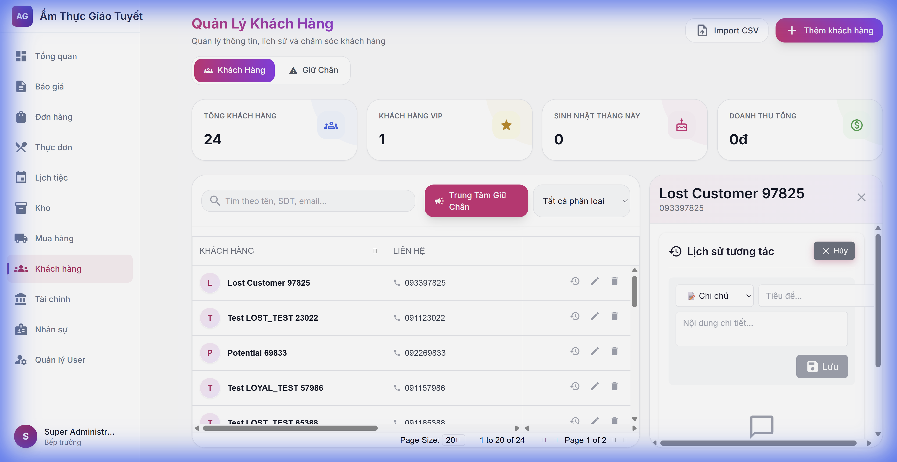
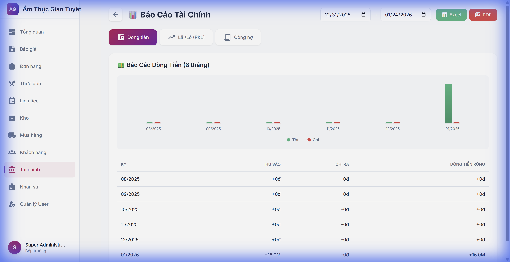
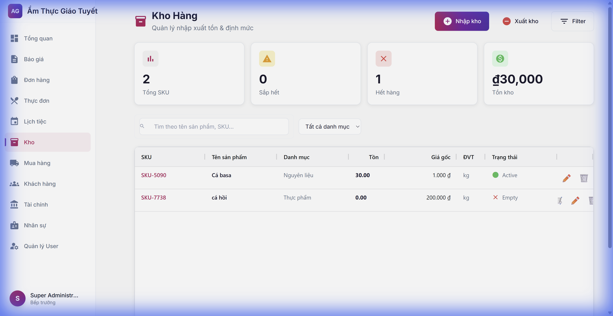
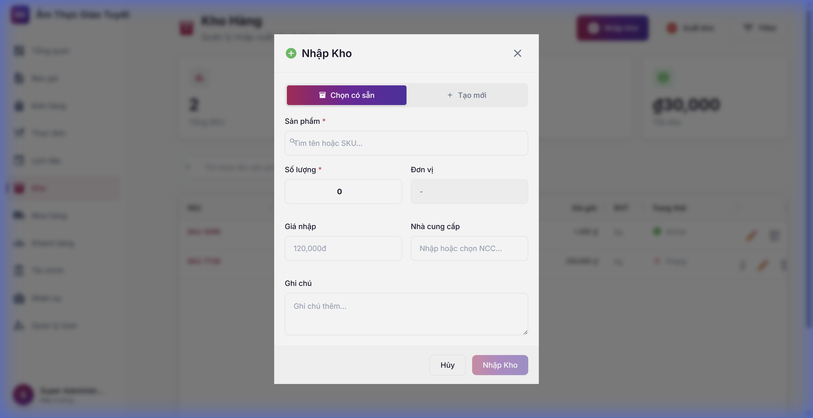

# Hướng dẫn Tính năng Sprint 2-3

> **Ngày cập nhật:** 24/01/2026  
> **Phiên bản:** 1.0

---

## 📋 Tổng quan

Tài liệu này hướng dẫn sử dụng các tính năng mới được cải tiến trong Sprint 2 và Sprint 3 của hệ thống CRM/ERP Catering.

---

## 1. CRM: Lịch sử Tương tác Khách hàng

### Mô tả
Theo dõi toàn bộ lịch sử tương tác với từng khách hàng (cuộc gọi, email, gặp mặt, ghi chú).

### Cách sử dụng

1. **Vào trang Khách hàng:** Chọn menu **Khách hàng** từ sidebar
2. **Mở lịch sử:** Click biểu tượng **🕐 (history)** trên dòng khách hàng
3. **Xem tương tác:** Panel trượt ra hiển thị danh sách tương tác
4. **Thêm mới:** Click "**Thêm mới**" để ghi nhận tương tác

### Các loại tương tác
- 📞 Gọi điện
- 📧 Email  
- 🤝 Gặp mặt
- 📝 Ghi chú
- 💬 Zalo/Facebook

---

## 2. Tài chính: Xuất báo cáo Excel/PDF

### Mô tả
Xuất báo cáo tài chính (thu/chi, công nợ) ra file Excel hoặc PDF.

### Cách sử dụng

1. **Vào Báo cáo Tài chính:** Menu **Tài chính** → **Báo cáo**
2. **Chọn khoảng thời gian:** Sử dụng 2 ô ngày ở góc phải
3. **Xuất báo cáo:**
   - Click **Excel** (xanh lá) để tải file `.xlsx`
   - Click **PDF** (đỏ) để xem file PDF

### Loại báo cáo
- **Transactions**: Danh sách thu/chi
- **Receivables**: Công nợ khách hàng

---

## 3. Kho: Nhập/Xuất kho

### Mô tả
Quản lý nhập xuất kho với giao diện cải tiến.

### Cách sử dụng

1. **Vào trang Kho:** Chọn menu **Kho** từ sidebar
2. **Xem tổng quan:** Dashboard hiển thị tổng SKU, hết hàng, giá trị
3. **Nhập kho:** Click nút **Nhập kho** (tím)
4. **Xuất kho:** Click nút **Xuất kho** (đỏ)

### Thông tin nhập kho
- Chọn sản phẩm hoặc tạo mới
- Số lượng và đơn vị
- Giá nhập
- Nhà cung cấp

---

## 4. Đơn hàng: Kiểm tra Xung đột Nhân viên

### Mô tả
Tự động cảnh báo khi phân công nhân viên đã có lịch vào cùng ngày.

### Cách hoạt động
- Khi phân công nhân viên, hệ thống tự động kiểm tra
- Nếu nhân viên đã có đơn hàng khác → Hiển thị cảnh báo
- Quản lý có thể xem lịch làm việc của nhân viên

---

## 5. HR: Lịch Nhân sự

### Mô tả
Xem tổng hợp nghỉ phép, ca làm, chấm công trên lịch.

### Cách sử dụng
1. **Vào HR → Lịch**
2. **Điều hướng:** Dùng nút ◀ ▶ để chuyển tháng
3. **Lọc sự kiện:** Chọn loại sự kiện cần xem

### Màu sắc
- 🔴 Đỏ: Nghỉ phép
- 🟢 Xanh: Ca làm
- 🔵 Xanh dương: Chấm công

---

## ❓ FAQ

### Q: Làm sao biết nhân viên có xung đột lịch?
A: Khi phân công, hệ thống tự động kiểm tra và hiển thị cảnh báo nếu có xung đột.

### Q: File Excel xuất ra ở đâu?
A: File được tải xuống tự động vào thư mục Downloads của máy tính.

### Q: Tôi có thể xem lại tương tác cũ không?
A: Có, mọi tương tác được lưu và hiển thị theo thời gian (mới nhất trước).

---

## 📞 Hỗ trợ

Liên hệ IT nếu gặp vấn đề khi sử dụng các tính năng trên.
