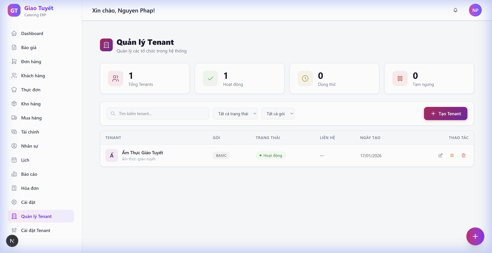
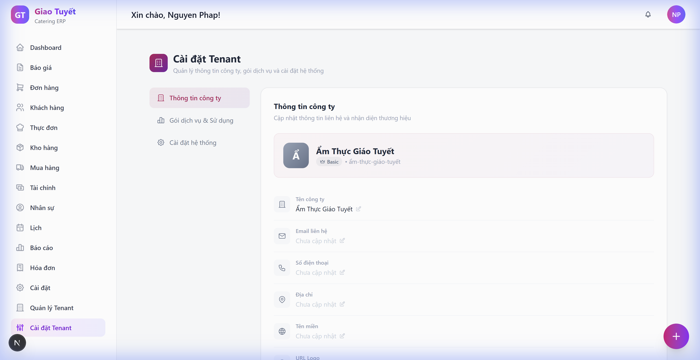
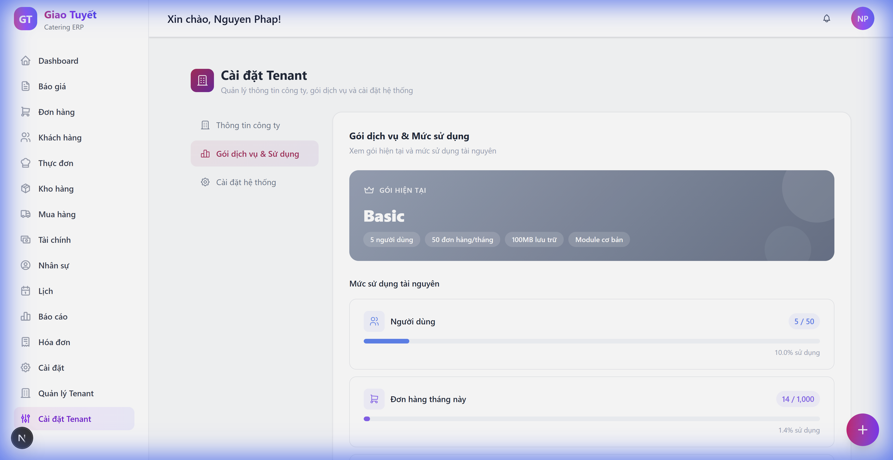
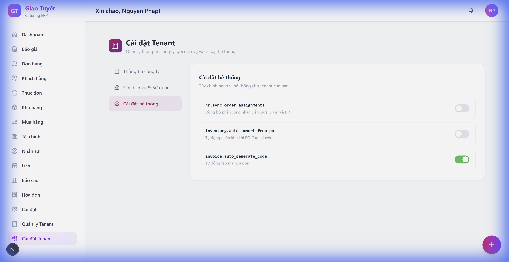

# Hướng Dẫn Sử Dụng: Quản Lý Tenant

> **Phiên bản**: 1.0  
> **Ngày cập nhật**: 10/02/2026  
> **Ngôn ngữ**: Tiếng Việt

---

## 1. Giới Thiệu

### Mô tả
Module **Quản lý Tenant** cho phép quản trị viên quản lý toàn bộ các tổ chức (tenant) trong hệ thống ERP. Mỗi tenant là một đơn vị kinh doanh độc lập với dữ liệu riêng biệt, gói dịch vụ riêng, và giới hạn tài nguyên theo gói.

Module bao gồm 2 trang chính:
- **Quản lý Tenant** (`/admin/tenants`): Dành cho Super Admin — xem, tạo, sửa, tạm ngưng, xóa tenant.
- **Cài đặt Tenant** (`/admin/tenant-settings`): Dành cho Admin — cập nhật thông tin công ty, xem gói dịch vụ & mức sử dụng, quản lý cài đặt hệ thống.

### Ai sử dụng?

| Vai trò | Quyền truy cập |
| :--- | :--- |
| **Super Admin** | Toàn quyền: tạo, sửa, xóa, tạm ngưng, kích hoạt, chuyển đổi tenant |
| **Admin** | Xem và cập nhật thông tin công ty, xem gói dịch vụ, quản lý cài đặt hệ thống |

---

## 2. Hướng Dẫn Sử Dụng

### 2.1. Trang Quản Lý Tenant (Super Admin)

#### Truy cập
1. Đăng nhập với tài khoản **Super Admin**
2. Từ menu bên trái, chọn **Quản lý Tenant**
3. Màn hình chính hiển thị thống kê và danh sách tenant

#### Các thẻ thống kê
Phía trên cùng hiển thị 4 thẻ tổng quan:
- **Tổng Tenant**: Số lượng tenant trong hệ thống
- **Hoạt động**: Tenant đang hoạt động bình thường
- **Dùng thử**: Tenant đang trong giai đoạn trial
- **Tạm ngưng**: Tenant đã bị tạm ngưng

#### Tìm kiếm & Lọc
- **Ô tìm kiếm**: Nhập tên hoặc mã tenant để tìm nhanh
- **Lọc trạng thái**: Chọn `Tất cả`, `Hoạt động`, `Dùng thử`, `Tạm ngưng`, `Đã hủy`
- **Lọc gói**: Chọn `Tất cả`, `Basic`, `Standard`, `Premium`, `Enterprise`

---

#### 2.1.1. Tạo Tenant Mới

**Bước 1**: Nhấn nút **"+ Tạo Tenant"** ở góc trên bên phải

**Bước 2**: Điền thông tin trong form:
| Trường | Bắt buộc | Mô tả |
| :--- | :---: | :--- |
| Tên Tenant | ✅ | Tên tổ chức/công ty |
| Gói dịch vụ | ✅ | Chọn: Basic, Standard, Premium, Enterprise |
| Email liên hệ |  | Email quản trị viên |
| Số điện thoại |  | SĐT liên hệ |
| Địa chỉ |  | Địa chỉ kinh doanh |

**Bước 3**: Nhấn **"Tạo"** để hoàn tất. Hệ thống sẽ tự động:
- Tạo slug URL từ tên (ví dụ: "Ẩm Thực Giao Tuyết" → `am-thuc-giao-tuyet`)
- Thiết lập cài đặt mặc định cho tenant
- Áp dụng giới hạn tài nguyên theo gói đã chọn

---

#### 2.1.2. Chỉnh Sửa Tenant

**Bước 1**: Tìm tenant trong danh sách

**Bước 2**: Nhấn nút **bút chỉnh sửa** (✏️) ở cột hành động

**Bước 3**: Cập nhật thông tin cần thay đổi

**Bước 4**: Nhấn **"Lưu"** để xác nhận

---

#### 2.1.3. Tạm Ngưng / Kích Hoạt Tenant

**Tạm ngưng**: Nhấn nút **⏸ Tạm ngưng** → Xác nhận trong hộp thoại
- Tenant bị tạm ngưng sẽ không thể truy cập hệ thống
- Dữ liệu được giữ nguyên, chỉ bị khóa truy cập

**Kích hoạt lại**: Nhấn nút **▶ Kích hoạt** → Xác nhận
- Tenant được khôi phục trạng thái hoạt động bình thường

---

#### 2.1.4. Xóa Tenant

**Bước 1**: Nhấn nút **🗑 Xóa** ở cột hành động

**Bước 2**: Xác nhận trong hộp thoại cảnh báo

> [!CAUTION]
> Thao tác xóa sẽ chuyển trạng thái tenant sang "Đã hủy". Đây là soft-delete — dữ liệu vẫn tồn tại trong DB nhưng tenant không thể truy cập.

---

### 2.2. Trang Cài Đặt Tenant (Admin)

#### Truy cập
1. Đăng nhập với tài khoản **Admin** hoặc **Super Admin**
2. Từ menu bên trái, chọn **Cài đặt Tenant**
3. Trang cài đặt hiển thị với 3 tab

---

#### 2.2.1. Tab: Thông Tin Công Ty

Tab mặc định khi truy cập. Hiển thị và cho phép chỉnh sửa thông tin tổ chức.

**Các trường có thể chỉnh sửa:**

| Trường | Mô tả | Cách sửa |
| :--- | :--- | :--- |
| **Tên công ty** | Tên hiển thị của tổ chức | Click vào giá trị → nhập → ✓ |
| **Email liên hệ** | Email quản trị chính | Click → nhập → ✓ |
| **Số điện thoại** | SĐT liên hệ | Click → nhập → ✓ |
| **Địa chỉ** | Địa chỉ kinh doanh | Click → nhập → ✓ |
| **Tên miền** | Domain riêng (nếu có) | Click → nhập → ✓ |
| **URL Logo** | Đường dẫn logo công ty | Click → nhập → ✓ |

**Cách chỉnh sửa từng trường:**
1. Click vào giá trị hiện tại (hoặc "Chưa cập nhật")
2. Ô nhập liệu xuất hiện — nhập giá trị mới
3. Nhấn **✓** (xanh lá) để lưu, hoặc **✗** để hủy
4. Thông báo "Đã lưu thành công!" hiện lên khi lưu thành công

---

#### 2.2.2. Tab: Gói Dịch Vụ & Sử Dụng

Hiển thị gói dịch vụ hiện tại và mức sử dụng tài nguyên theo thời gian thực.

**Thẻ gói dịch vụ**: Hiển thị tên gói (Basic/Standard/Premium/Enterprise) cùng các tính năng đi kèm.

**Thanh sử dụng tài nguyên:**

| Tài nguyên | Mô tả | Cảnh báo |
| :--- | :--- | :--- |
| **Người dùng** | Số tài khoản đang hoạt động / giới hạn | 🟡 ≥80%, 🔴 ≥95% |
| **Đơn hàng tháng này** | Số đơn hàng tạo trong tháng / giới hạn | 🟡 ≥80%, 🔴 ≥95% |
| **Dung lượng lưu trữ** | Dung lượng đã sử dụng / giới hạn | 🟡 ≥80%, 🔴 ≥95% |

Hệ thống tự động thay đổi màu thanh tiến trình:
- **Xanh dương/tím/xanh lá**: Mức sử dụng bình thường (<80%)
- **Vàng cam** 🟡: Sắp đạt giới hạn (≥80%)
- **Đỏ** 🔴: Gần giới hạn (≥95%) — hiển thị cảnh báo "⚠ Sắp đầy!"

**Nâng cấp gói**: Nhấn nút **"Liên hệ nâng cấp"** ở cuối tab để yêu cầu nâng cấp.

---

#### 2.2.3. Tab: Cài Đặt Hệ Thống

Quản lý các cờ tính năng (feature flags) cho tenant.

Mỗi cài đặt hiển thị dưới dạng **công tắc bật/tắt** (toggle switch):
- **Xanh lá** = Đang bật (true)
- **Xám** = Đang tắt (false)

Click vào công tắc để thay đổi trạng thái. Thay đổi được lưu tức thì.

---

## 3. Giới Hạn Theo Gói Dịch Vụ

| Tính năng | Basic | Standard | Premium | Enterprise |
| :--- | :---: | :---: | :---: | :---: |
| **Người dùng** | 5 | 15 | 50 | Không giới hạn |
| **Đơn hàng/tháng** | 50 | 200 | 1.000 | Không giới hạn |
| **Lưu trữ** | 100MB | 1GB | 10GB | 100GB |
| **Module** | 4 cơ bản | +HR, CRM | Tất cả | Tùy chỉnh |

> [!WARNING]
> Khi đạt giới hạn tài nguyên, hệ thống sẽ **từ chối tạo mới** (người dùng hoặc đơn hàng) và hiển thị thông báo yêu cầu nâng cấp gói.

---

## 4. Lưu Ý Quan Trọng

> [!WARNING]
> **Bảo mật dữ liệu**: Mỗi tenant có dữ liệu hoàn toàn tách biệt. Super Admin phải cẩn thận khi tạm ngưng hoặc xóa tenant vì sẽ ảnh hưởng đến tất cả người dùng trong tenant đó.

> [!TIP]
> **Mẹo sử dụng hiệu quả**: 
> - Theo dõi mức sử dụng tài nguyên định kỳ qua tab "Gói dịch vụ & Sử dụng"
> - Thiết lập email liên hệ ngay khi tạo tenant để nhận thông báo hệ thống
> - Sử dụng tính năng tìm kiếm để nhanh chóng tìm tenant khi quản lý nhiều tổ chức

---

## 5. Câu Hỏi Thường Gặp (FAQ)

### Q1: Tạm ngưng tenant có mất dữ liệu không?
**A**: Không. Tạm ngưng chỉ khóa truy cập — tất cả dữ liệu (đơn hàng, khách hàng, tài chính...) được giữ nguyên. Khi kích hoạt lại, mọi thứ trở lại bình thường.

### Q2: Sự khác biệt giữa "Tạm ngưng" và "Xóa"?
**A**: 
- **Tạm ngưng**: Khóa truy cập tạm thời, có thể kích hoạt lại bất cứ lúc nào
- **Xóa**: Chuyển sang trạng thái "Đã hủy", không thể kích hoạt lại qua giao diện

### Q3: Làm sao để nâng cấp gói dịch vụ?
**A**: Vào **Cài đặt Tenant** → tab **"Gói dịch vụ & Sử dụng"** → nhấn **"Liên hệ nâng cấp"**. Hoặc liên hệ trực tiếp Super Admin.

### Q4: Tại sao tôi không tạo thêm người dùng mới được?
**A**: Bạn đã đạt giới hạn người dùng theo gói hiện tại. Kiểm tra mức sử dụng tại tab "Gói dịch vụ & Sử dụng" và liên hệ nâng cấp gói.

### Q5: Admin có thể xem thông tin của tenant khác không?
**A**: Không. Admin chỉ xem được thông tin tenant của mình. Chỉ Super Admin mới có quyền xem và quản lý tất cả tenant.

### Q6: Cài đặt hệ thống ảnh hưởng gì?
**A**: Các cờ tính năng (feature flags) kiểm soát hành vi hệ thống cho tenant. Ví dụ: bật/tắt đồng bộ nhân sự, tự động import đơn mua hàng... Thay đổi có hiệu lực ngay lập tức.

---

## 6. Liên Hệ Hỗ Trợ

Nếu bạn gặp vấn đề, vui lòng liên hệ:
- **Email**: support@amthucgiatuyet.com
- **Hotline**: 1900-xxxx

---

*Tài liệu này được tạo tự động bởi AI Workforce. Ngày tạo: 10/02/2026*
