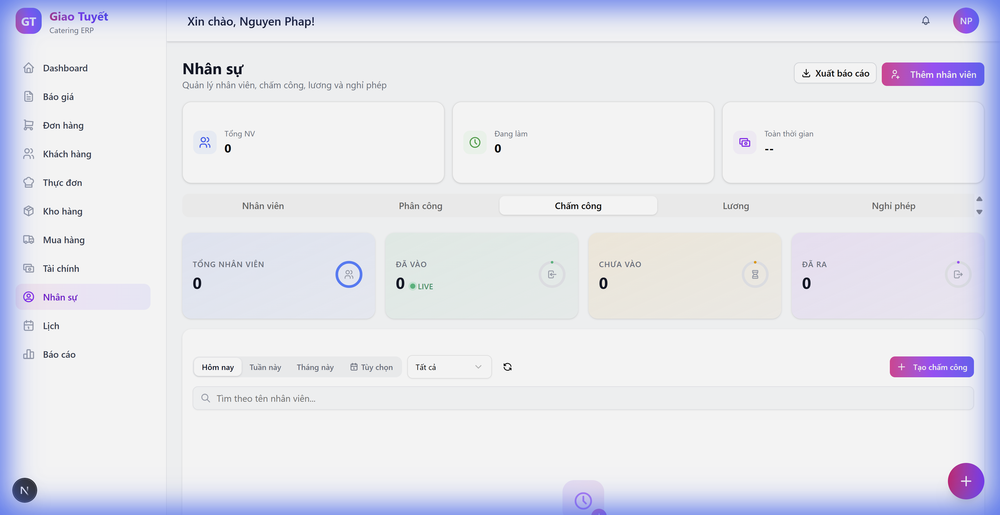

# Hướng Dẫn: Tab Chấm Công — Các Tính Năng Mới

> **Ngày cập nhật**: 21/02/2026  
> **Module**: Nhân Sự → Chấm Công  
> **Phiên bản**: PRD v2.0

---

## 1. Giới Thiệu

Tab **Chấm Công** đã được nâng cấp với 5 tính năng mới giúp quản lý chấm công hiệu quả hơn:

| # | Tính Năng | Mô Tả |
|:--|:----------|:------|
| 1 | **Xuất dữ liệu** | Export Excel (.xlsx) và CSV (.csv) |
| 2 | **Tổng hợp theo tuần/tháng** | Xem tổng số giờ theo từng nhân viên |
| 3 | **Phát hiện giờ tăng ca** | Badge OT trên stat cards + highlight dòng vàng |
| 4 | **Hành động hàng loạt** | Badge đếm, loading spinner, thông báo thành công |
| 5 | **Cảnh báo đi trễ** | Badge đỏ "Trễ Xp" + highlight dòng đỏ |

---

## 2. Hướng Dẫn Sử Dụng

### 2.1 Xuất Dữ Liệu (Export)

1. Mở tab **Chấm Công** trong module Nhân Sự
2. Chọn khoảng thời gian cần xuất (Hôm nay / Tuần này / Tháng này)
3. Nhấn nút **"Xuất"** (icon download) trên thanh lọc
4. Chọn định dạng:
   - **Excel (.xlsx)**: File chuyên nghiệp với header branded, OT highlight, summary row
   - **CSV (.csv)**: File nhẹ tương thích mọi phần mềm

> **Lưu ý**: Nút "Xuất" chỉ hiển thị khi có dữ liệu.

### 2.2 Tổng Hợp Theo Tuần/Tháng

1. Chuyển sang **"Tuần này"** hoặc **"Tháng này"**
2. Bảng tự động chuyển sang chế độ **Summary View**:
   - Mỗi nhân viên hiển thị **1 dòng** với tổng ngày, giờ, OT
   - Nhấn vào dòng nhân viên để **mở rộng** xem chi tiết từng ngày
   - Dòng footer hiển thị **tổng cộng** toàn bộ

3. Khi chuyển về **"Hôm nay"**, bảng tự trở lại chế độ flat table thông thường.

### 2.3 Phát Hiện Giờ Tăng Ca (OT)

- **Stat Cards**: Badge ⚠️ hiển thị tổng giờ OT (nếu > 0h)
- **Dòng trong bảng**: Viền vàng bên trái cho các bản ghi có OT
- OT được tính tự động dựa trên `overtime_hours` từ backend

### 2.4 Hành Động Hàng Loạt (Bulk Actions)

1. Chọn các bản ghi cần duyệt bằng checkbox
2. Badge tím hiển thị số lượng đã chọn (ví dụ: **"3 đã chọn"**)
3. Nhấn **"Duyệt (3)"** hoặc **"Từ chối"**:
   - Loading spinner hiển thị trong khi xử lý
   - Thông báo thành công: *"Đã duyệt 3 bản chấm công"*
4. Danh sách tự động bỏ chọn sau khi hoàn tất

### 2.5 Cảnh Báo Đi Trễ (Late Check-in)

- **Ngưỡng**: Nhân viên check-in trễ hơn **15 phút** so với giờ lịch
- **Stat Cards**: Badge 🟠 hiển thị số lượng trễ giờ (trên thẻ "Đã vào")
- **Dòng trong bảng**: 
  - Viền đỏ bên trái
  - Badge nhỏ **"Trễ Xp"** (ví dụ: "Trễ 23p") cạnh tên nhân viên
  - Hover để xem chi tiết: *"Trễ 23 phút"*

---

## 3. FAQ

### Q: Nút "Xuất" không hiển thị?
**A**: Nút chỉ hiển thị khi có dữ liệu chấm công. Hãy chọn khoảng thời gian có bản ghi.

### Q: Summary View hiển thị khi nào?
**A**: Khi chọn "Tuần này" hoặc "Tháng này". Chế độ "Hôm nay" luôn hiển thị bảng chi tiết.

### Q: Làm sao biết nhân viên nào đi trễ?
**A**: Dòng có viền đỏ + badge "Trễ Xp" cạnh tên. Stat card "Đã vào" cũng hiển thị tổng số trễ giờ.

### Q: File Excel có gì đặc biệt?
**A**: Header branded (logo + gradient tím), alternating rows, OT highlighted vàng, summary row ở cuối, status có màu riêng.

### Q: Duyệt hàng loạt có giới hạn?
**A**: Không giới hạn số lượng. Chỉ các bản ghi **"Chờ duyệt"** đã check-out mới có checkbox.

---

## 4. Tổng Kết Thay Đổi Kỹ Thuật

| File | Trạng thái | Mô tả |
|:-----|:-----------|:------|
| `timesheet-export.ts` | **MỚI** | CSV + Excel export engine |
| `timesheet-summary-table.tsx` | **MỚI** | Weekly/monthly summary view |
| `timesheet-filter-bar.tsx` | Sửa | Thêm export dropdown, enhanced bulk actions |
| `TimeSheetTab.tsx` | Sửa | Conditional rendering, OT/late counts, toast |
| `timesheet-stat-cards.tsx` | Sửa | OT + late count badges |
| `timesheet-data-table.tsx` | Sửa | Late detection, OT row highlight |
