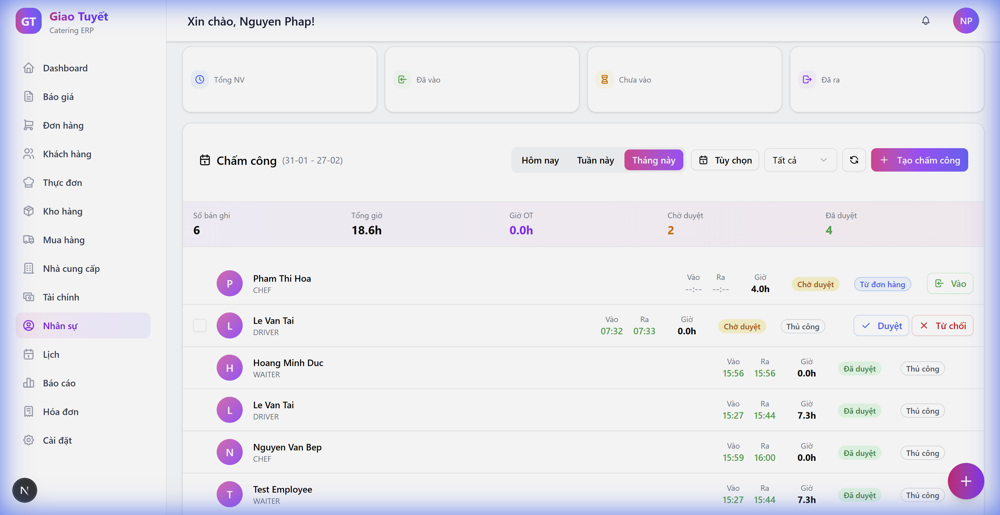
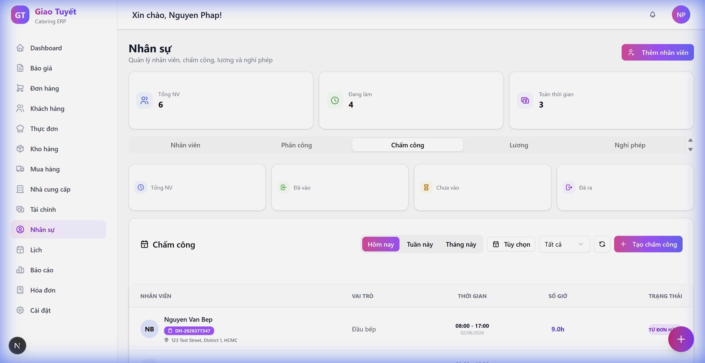

# Hướng dẫn: Hiển thị Ngữ cảnh Đơn hàng trong Bảng Chấm công

> **Cập nhật**: 06/02/2026

## Giới thiệu

Tính năng này cho phép HR Manager xem thông tin đơn hàng trực tiếp trong bảng chấm công, giúp dễ dàng xác định nhân viên làm việc cho đơn nào mà không cần chuyển sang module Đơn hàng.

---

## Trước và Sau

### Trước khi cập nhật

*Chỉ hiển thị badge "Từ đơn hàng" nhưng không có chi tiết*

### Sau khi cập nhật

*Hiển thị đầy đủ: Mã đơn hàng + Địa điểm sự kiện*

---

## Thông tin được hiển thị

| Thông tin | Icon | Ví dụ |
|:----------|:----:|:------|
| **Mã đơn hàng** | 📋 | DH-2026377347 |
| **Địa điểm** | 📍 | 123 Test Street, District 1, HCMC |

---

## Hướng dẫn sử dụng

### Bước 1: Mở module Nhân sự
Vào **Nhân sự** → Tab **Chấm công**

### Bước 2: Chọn khoảng thời gian
Sử dụng nút **Tuần này** hoặc **Tháng này** để xem nhiều entries

### Bước 3: Xem thông tin đơn hàng
- Entries có badge **"Từ đơn hàng"** sẽ hiển thị:
  - Mã đơn hàng (màu tím)
  - Địa điểm sự kiện
- Entries có badge **"Thủ công"** không hiển thị thông tin này

---

## FAQ

### Q: Tại sao một số entries không hiển thị mã đơn hàng?
**A:** Chỉ những entries được tạo tự động từ Staff Assignment mới có liên kết đến đơn hàng. Entries tạo thủ công không có thông tin này.

### Q: Tôi có thể click vào mã đơn để xem chi tiết không?
**A:** Tính năng này đang được phát triển trong phiên bản tới.

### Q: Địa điểm bị cắt ngắn, làm sao xem đầy đủ?
**A:** Di chuột (hover) lên địa điểm để xem tooltip với địa chỉ đầy đủ.

---

## Thay đổi kỹ thuật

### Backend
- Thêm JOIN với bảng Orders để lấy order_code, customer_name, event_address
- File: `backend/modules/hr/infrastructure/http_router.py`

### Frontend
- Thêm hiển thị inline dưới tên nhân viên
- Icons: IconClipboard (mã đơn), IconMapPin (địa điểm)
- File: `frontend/src/app/(dashboard)/hr/components/TimeSheetTab.tsx`
