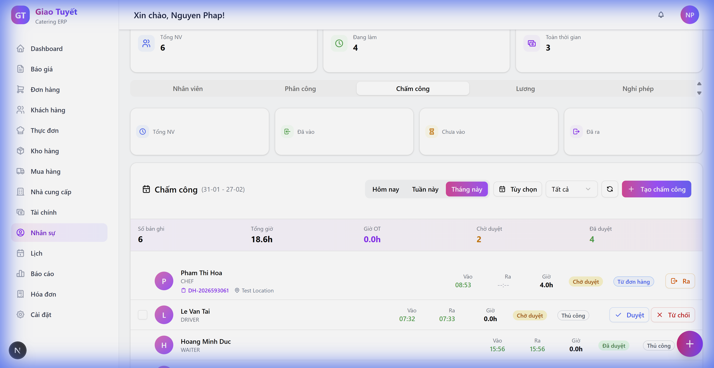

# Hướng Dẫn Chỉnh Sửa Giờ Chấm Công

**Ngày cập nhật:** 06/02/2026

## Giới Thiệu

Tính năng **Chỉnh sửa giờ chấm công** cho phép HR Manager sửa giờ vào/ra của nhân viên trực tiếp trên bảng chấm công. Mọi thay đổi được ghi nhận đầy đủ để đảm bảo tính minh bạch.

---

## Hướng Dẫn Sử Dụng

### Bước 1: Truy cập module Chấm công
1. Vào **Nhân sự** > **Chấm công** tab
2. Chọn khoảng thời gian cần xem

### Bước 2: Chỉnh sửa giờ
1. **Di chuột** vào giờ Vào/Ra của bản ghi cần sửa
2. Click **biểu tượng bút chì** (✏️) xuất hiện bên phải
3. **Nhập giờ mới** vào ô Time Picker
4. Click **nút xanh ✓** để lưu hoặc **nút X** để hủy

### Bước 3: Nhận biết bản ghi đã chỉnh sửa
- Bản ghi đã sửa sẽ hiển thị biểu tượng **🔄** bên cạnh giờ
- Di chuột vào 🔄 để xem giờ gốc trước khi sửa

---

## Lưu Ý Quan Trọng

| Điều kiện | Cho phép sửa? |
|-----------|---------------|
| Trạng thái **Chờ duyệt** | ✅ Có |
| Trạng thái **Đã duyệt** | ❌ Không (phải mở khóa trước) |
| Giờ ra phải sau giờ vào | ✅ Bắt buộc |

---

## FAQ

**Q: Tôi có thể sửa giờ đã duyệt không?**  
A: Không. Bạn cần mở khóa bản ghi (chuyển về "Chờ duyệt") trước khi sửa.

**Q: Làm sao biết ai đã sửa giờ?**  
A: Hệ thống tự động lưu thông tin người sửa, thời gian sửa, và lý do (nếu có).

**Q: Giờ gốc có bị mất không?**  
A: Không. Giờ gốc được lưu lại và có thể xem bằng cách hover vào icon 🔄.

---

## Thông Tin Kỹ Thuật

- **Backend API:** `PATCH /hr/timesheets/{id}/time`
- **Audit Fields:** `original_start`, `original_end`, `time_edited_by`, `time_edited_at`, `edit_reason`
- **Database:** PostgreSQL với migration `050_timesheet_time_editing.sql`
