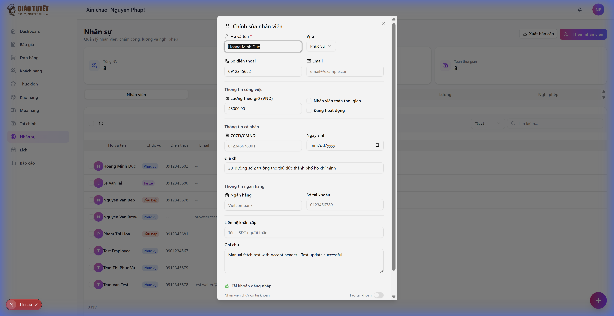

# Hướng dẫn Quản lý Tài khoản Đăng nhập Nhân viên

> **Module**: Nhân sự (HR)  
> **Ngày cập nhật**: 19/02/2026  
> **Đối tượng**: Quản lý, Admin

---

## 1. Giới thiệu

Tính năng **Quản lý Tài khoản Đăng nhập** cho phép Admin/Quản lý tạo và quản lý tài khoản đăng nhập hệ thống cho từng nhân viên ngay trong form chỉnh sửa nhân viên. 

Mỗi nhân viên có thể được liên kết với một tài khoản đăng nhập (User) để truy cập hệ thống ERP.

### Các chức năng chính:
- ✅ **Tạo tài khoản** đăng nhập khi thêm mới nhân viên
- ✅ **Tạo tài khoản sau** cho nhân viên chưa có tài khoản
- ✅ **Xem thông tin** tài khoản đã liên kết (email, vai trò, trạng thái)
- ✅ **Thay đổi vai trò** hệ thống (Staff / Manager / Admin)
- ✅ **Đặt lại mật khẩu** cho nhân viên

---

## 2. Hướng dẫn sử dụng

### 2.1 Tạo tài khoản khi thêm nhân viên mới

1. Vào **Nhân sự** từ menu bên trái
2. Nhấn nút **"+ Thêm nhân viên"** ở góc phải trên
3. Điền thông tin nhân viên (họ tên, chức vụ, số điện thoại, v.v.)
4. Ở cuối form, phần **"Tài khoản đăng nhập"**:
   - Bật công tắc **"Tạo tài khoản"** (mặc định đã bật)
   - Nhập **Email đăng nhập** (ví dụ: `nhanvien@giaotuyet.com`)
   - **Mật khẩu** mặc định là `GiaoTuyet@2026` — có thể sao chép bằng nút copy
   - Chọn **Vai trò hệ thống**: Nhân viên (Staff), Quản lý (Manager), hoặc Admin
5. Nhấn **"Thêm nhân viên"** để lưu

> 💡 **Mẹo**: Nếu không muốn tạo tài khoản ngay, tắt công tắc "Tạo tài khoản". Có thể tạo sau khi chỉnh sửa nhân viên.

---

### 2.2 Tạo tài khoản cho nhân viên đã có (chưa có tài khoản)

1. Mở form **Chỉnh sửa nhân viên** bằng cách di chuột lên dòng nhân viên → nhấn icon ✏️ (bút chỉnh sửa)
2. Cuộn xuống phần **"Tài khoản đăng nhập"**
3. Bạn sẽ thấy dòng **"Nhân viên chưa có tài khoản"** với công tắc **"Tạo tài khoản"**
4. Bật công tắc → form tạo tài khoản hiện ra (email, mật khẩu, vai trò)
5. Điền thông tin và nhấn **"Lưu"**

---

### 2.3 Quản lý tài khoản đã liên kết

Khi nhân viên đã có tài khoản đăng nhập, form chỉnh sửa sẽ hiển thị:

- 🟢 **"Đã liên kết tài khoản"** — trạng thái xanh
- **Email đăng nhập** — hiển thị dạng chỉ đọc (không sửa được)
- **Vai trò hệ thống** — dropdown cho phép thay đổi (Staff / Manager / Admin)
- **Trạng thái tài khoản** — Hoạt động / Đã khóa

#### Thay đổi vai trò:
1. Mở form chỉnh sửa nhân viên
2. Cuộn xuống phần **"Tài khoản đăng nhập"**
3. Chọn vai trò mới từ dropdown **"Vai trò hệ thống"**
4. Nhấn **"Lưu"** để cập nhật

---

### 2.4 Đặt lại mật khẩu

1. Mở form chỉnh sửa nhân viên (nhân viên đã có tài khoản)
2. Cuộn xuống phần **"Tài khoản đăng nhập"**
3. Nhấn nút **"Đặt lại mật khẩu"** (màu cam)
4. Mật khẩu mới sẽ hiển thị trên màn hình — nhấn nút 📋 để sao chép
5. Gửi mật khẩu mới cho nhân viên

> ⚠️ **Lưu ý**: Mật khẩu mặc định sau khi reset là `GiaoTuyet@{năm hiện tại}`. Nhân viên nên đổi mật khẩu ngay sau khi đăng nhập.

---

## 3. Bảng vai trò hệ thống

| Vai trò | Quyền hạn |
| :--- | :--- |
| **Nhân viên (Staff)** | Xem thông tin cá nhân, chấm công, xin nghỉ phép |
| **Quản lý (Manager)** | Quản lý nhân viên, duyệt nghỉ phép, xem báo cáo |
| **Admin** | Toàn quyền truy cập hệ thống |

---

## 4. FAQ — Câu hỏi thường gặp

### ❓ Nhân viên quên mật khẩu thì làm sao?
→ Vào form Chỉnh sửa nhân viên → nhấn **"Đặt lại mật khẩu"** → gửi mật khẩu mới cho nhân viên.

### ❓ Có thể tạo nhiều tài khoản cho một nhân viên không?
→ Không. Mỗi nhân viên chỉ liên kết được **1 tài khoản** đăng nhập duy nhất.

### ❓ Tôi muốn khóa tài khoản nhân viên đã nghỉ việc?
→ Hiện tại trạng thái tài khoản hiển thị ở dạng chỉ đọc. Liên hệ Admin để khóa tài khoản.

### ❓ Email đăng nhập có thể thay đổi không?
→ Không thể thay đổi email đăng nhập sau khi tạo. Nếu cần đổi, liên hệ Admin.

### ❓ Mật khẩu mặc định khi tạo tài khoản là gì?
→ Mật khẩu mặc định: `GiaoTuyet@{năm hiện tại}` (ví dụ: `GiaoTuyet@2026`).

---

## 5. API Endpoints (Dành cho Dev)

| Endpoint | Method | Mô tả |
| :--- | :--- | :--- |
| `/api/v1/hr/employees` | `PUT` | Cập nhật nhân viên + tạo/cập nhật tài khoản |
| `/api/v1/hr/employees/{id}/reset-password` | `POST` | Đặt lại mật khẩu |
| `/api/v1/hr/employees/{id}/account` | `PATCH` | Cập nhật vai trò, trạng thái tài khoản |
