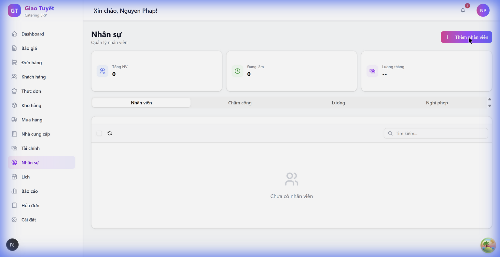
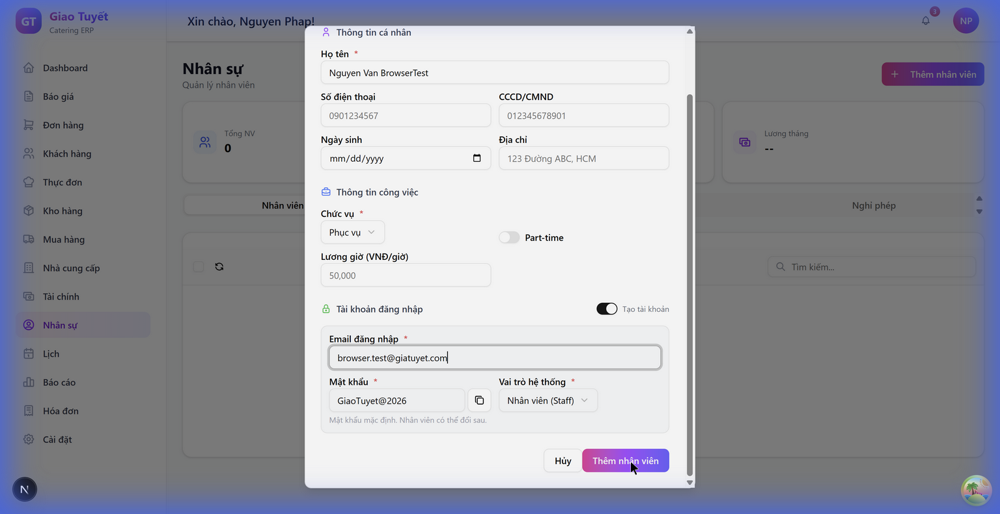
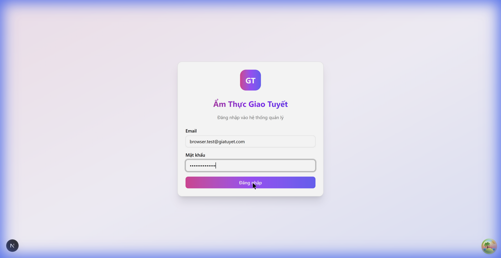

# Hướng dẫn: Tích hợp Nhân viên & Tài khoản đăng nhập

> **Module**: Nhân sự (HR) + Quản trị (Admin)
> **Ngày cập nhật**: 18/02/2026
> **Phiên bản**: 1.0

---

## 1. Giới thiệu

Tính năng **Tích hợp User-Employee** cho phép tạo nhân viên và tài khoản đăng nhập hệ thống **trong cùng một thao tác**. Trước đây, quản trị viên phải:

1. Tạo nhân viên ở trang Nhân sự
2. Rồi tạo tài khoản riêng ở trang Quản trị

Giờ đây, chỉ cần **1 bước** tại trang Nhân sự → hệ thống tự động tạo cả hai.

---

## 2. Hướng dẫn sử dụng

### 2.1. Thêm nhân viên mới (có tài khoản đăng nhập)

**Bước 1**: Vào menu **Nhân sự** trên thanh sidebar.

**Bước 2**: Nhấn nút **"+ Thêm nhân viên"** (nút tím gradient ở góc phải trên).

**Bước 3**: Điền form 3 phần:

| Phần | Các trường | Bắt buộc |
| :--- | :--- | :---: |
| **Thông tin cá nhân** | Họ tên, SĐT, CCCD, Ngày sinh, Địa chỉ | Họ tên ✅ |
| **Thông tin công việc** | Chức vụ, Full-time/Part-time, Lương | Chức vụ ✅ |
| **Tài khoản đăng nhập** | Email, Mật khẩu, Vai trò hệ thống | Email ✅ |

> **Lưu ý**: Phần "Tài khoản đăng nhập" có toggle bật/tắt. Khi **TẮT**, chỉ tạo nhân viên (không có tài khoản đăng nhập).

**Bước 4**: Nhấn **"Thêm nhân viên"** để hoàn tất.

**Bước 5**: Hệ thống sẽ:
- ✅ Tạo hồ sơ nhân viên trong module HR
- ✅ Tự động tạo tài khoản đăng nhập (nếu bật)
- ✅ Liên kết 2 bản ghi qua `user_id`

### 2.2. Nhân viên đăng nhập với tài khoản mới

Sau khi tạo, nhân viên có thể đăng nhập bằng email và mật khẩu đã thiết lập:

### 2.3. Thêm người dùng (trang Quản trị)

Trang **Cài đặt > Quản trị** cũng có nút **"+ Thêm người dùng"** để tạo tài khoản đăng nhập nhanh mà không cần tạo hồ sơ nhân viên.

---

## 3. Các vai trò hệ thống

| Vai trò | Quyền hạn |
| :--- | :--- |
| **Staff** (Nhân viên) | Xem và tạo đơn hàng |
| **Manager** (Quản lý) | Quản lý đơn hàng, khách hàng, nhân sự |
| **Admin** | Toàn quyền quản trị |

---

## 4. Chức vụ nhân viên

| Chức vụ | Mã |
| :--- | :--- |
| Đầu bếp | CHEF |
| Phục vụ | WAITER |
| Tài xế | DRIVER |
| Quản lý | MANAGER |
| Pha chế | BARTENDER |
| Khác | OTHER |

---

## 5. FAQ

### Q: Có thể tạo nhân viên mà không tạo tài khoản đăng nhập không?
**A**: Có. Trong form thêm nhân viên, tắt toggle **"Tạo tài khoản"** ở phần thứ 3. Nhân viên sẽ được tạo hồ sơ nhưng không có tài khoản đăng nhập.

### Q: Mật khẩu mặc định là gì?
**A**: Hệ thống tự động tạo mật khẩu mặc định `GiaoTuyet@2026`. Admin có thể copy mật khẩu này (nút copy bên cạnh) để gửi cho nhân viên. Nhân viên có thể đổi mật khẩu sau khi đăng nhập.

### Q: Một nhân viên có thể có nhiều tài khoản không?
**A**: Không. Mỗi nhân viên chỉ liên kết được với 1 tài khoản đăng nhập (quan hệ 1:1).

### Q: Email đăng nhập có cần trùng với email cá nhân không?
**A**: Không bắt buộc. Email đăng nhập và email liên lạc là 2 trường riêng biệt.

### Q: Xóa nhân viên có ảnh hưởng tài khoản đăng nhập không?
**A**: Hiện tại, xóa nhân viên sẽ vô hiệu hóa (deactivate) nhân viên nhưng giữ tài khoản đăng nhập. Admin cần xóa tài khoản riêng tại trang Quản trị nếu cần.
