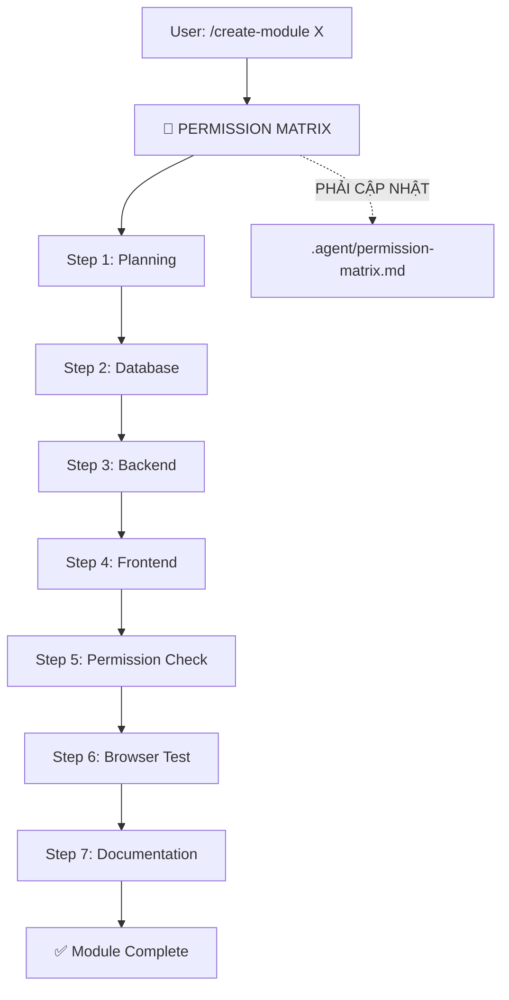

# 🤖 AI WORKFORCE MANUAL - ẨM THỰC GIÁO TUYẾT

> **Phiên bản**: 2.0 | **Cập nhật**: 2026-01-17
> **Hệ thống**: Modular AI Workforce cho Catering ERP

---

## 📋 MỤC LỤC

1. [Tổng quan Kiến trúc](#1-tổng-quan-kiến-trúc)
2. [Thành phần Hệ thống](#2-thành-phần-hệ-thống)
3. [Quy trình Làm việc (Workflows)](#3-quy-trình-làm-việc-workflows)
4. [Hướng dẫn Sử dụng Chi tiết](#4-hướng-dẫn-sử-dụng-chi-tiết)
5. [Ví dụ Thực tế](#5-ví-dụ-thực-tế)

---

## 1. TỔNG QUAN KIẾN TRÚC

### 1.1 Sơ đồ Hệ thống

```
                         ┌─────────────────────────┐
                         │   👤 USER REQUEST       │
                         └───────────┬─────────────┘
                                     ↓
┌────────────────────────────────────────────────────────────────────┐
│                    🎯 ORCHESTRATOR AGENT                            │
│  (prompts/orchestrator.md)                                         │
│  - Điều phối toàn bộ workflow                                      │
│  - 7-Step Process: Roadmap → Analysis → Assign → Test → Permission │
└────────────────────────────────────┬───────────────────────────────┘
                                     ↓
         ┌───────────────────────────┼───────────────────────────┐
         ↓                           ↓                           ↓
┌─────────────────┐       ┌─────────────────┐       ┌─────────────────┐
│ 📜 GLOBAL RULES │       │ 🔄 WORKFLOWS    │       │ 🧠 SPECIALISTS  │
│ (prompts/rules) │       │ (.agent/workflows)│     │ (prompts/specs) │
├─────────────────┤       ├─────────────────┤       ├─────────────────┤
│ • core.md       │       │ • /create-module│       │ • backend.md    │
│ • frontend.md   │       │ • /create-feature│      │ • frontend.md   │
│ • database.md   │       │ • /fix-bug      │       │ • database.md   │
│ • security.md   │       │ • /refactor     │       │ • security.md   │
│ • domain-logic  │       │                 │       │ • qa.md         │
└─────────────────┘       └─────────────────┘       │ • devops.md     │
                                                    │ • browser-test  │
                                                    └─────────────────┘
                                     ↓
         ┌───────────────────────────┼───────────────────────────┐
         ↓                           ↓                           ↓
┌─────────────────┐       ┌─────────────────┐       ┌─────────────────┐
│ 📦 DOMAIN AGENTS│       │ ✅ VALIDATORS   │       │ 🔐 PERMISSIONS  │
│ (prompts/modules)│      │ (prompts/valid) │       │ (.agent/)       │
├─────────────────┤       ├─────────────────┤       ├─────────────────┤
│ • menu.md       │       │ • dod-runner    │       │ permission-     │
│ • quote.md      │       │ • permission-   │       │ matrix.md       │
│ • order.md      │       │   engine        │       │                 │
│ • calendar.md   │       │ • schema-valid  │       │ api-contracts   │
│ • finance.md    │       │ • integrity     │       │ .md             │
│ • hr.md, crm.md │       │                 │       │                 │
│ • dashboard.md  │       │                 │       │                 │
│ + 6 more...     │       │                 │       │                 │
└─────────────────┘       └─────────────────┘       └─────────────────┘
```

### 1.2 Tech Stack

| Layer | Technology | Version |
| :--- | :--- | :--- |
| **Backend** | Python FastAPI | 3.12+ |
| **Frontend** | Angular Standalone | 18+ |
| **Database** | PostgreSQL + RLS | 16+ |
| **ORM** | SQLAlchemy Async | 2.0+ |
| **UI Design** | Linear Design System | Custom |

---

## 2. THÀNH PHẦN HỆ THỐNG

### 2.1 Specialist Agents (9 agents)

| Agent | File | Chức năng |
| :--- | :--- | :--- |
| **Backend** | `specialists/backend.md` | Viết FastAPI routes, services, DTOs |
| **Frontend** | `specialists/frontend.md` | Viết Angular components, services |
| **Database** | `specialists/database.md` | SQL migrations, RLS policies |
| **Security** | `specialists/security.md` | Permissions, RBAC, Auth |
| **QA** | `specialists/qa.md` | Unit tests, integration tests |
| **DevOps** | `specialists/devops.md` | Docker, CI/CD, deployment |
| **Browser Test** | `specialists/browser-test.md` | UI testing, screenshots |
| **Auto-Correction** | `specialists/auto-correction.md` | Self-fix khi có lỗi |

### 2.2 Domain Agents (13 modules)

| Module | File | Mô tả |
| :--- | :--- | :--- |
| **Dashboard** | `modules/dashboard.md` | KPI Homepage (Linear Design) |
| **Menu** | `modules/menu.md` | Quản lý thực đơn |
| **Quote** | `modules/quote.md` | Báo giá |
| **Order** | `modules/order.md` | Đơn hàng |
| **Calendar** | `modules/calendar.md` | Lịch tiệc |
| **Procurement** | `modules/procurement.md` | Mua hàng, NCC |
| **HR** | `modules/hr.md` | Nhân sự |
| **Finance** | `modules/finance.md` | Tài chính |
| **CRM** | `modules/crm.md` | Khách hàng |
| **Analytics** | `modules/analytics.md` | Báo cáo |
| **Inventory** | `modules/inventory.md` | Kho, BOM |
| **Mobile** | `modules/mobile.md` | API cho Staff App |
| **Notification** | `modules/notification.md` | Thông báo |

### 2.3 Validators (5 engines)

| Validator | File | Chức năng |
| :--- | :--- | :--- |
| **DoD Runner** | `validators/dod-runner.md` | Kiểm tra Definition of Done |
| **Permission Engine** | `validators/permission-engine.md` | Kiểm tra Permission Matrix |
| **Schema Validator** | `validators/schema-validator.md` | Validate DB schema |
| **Integrity Check** | `validators/integrity-check.md` | Kiểm tra data consistency |

### 2.4 Utility Prompts (6 tools)

| Tool | File | Chức năng |
| :--- | :--- | :--- |
| **API Contract Gen** | `api-contract-generator.md` | Sinh API docs |
| **Domain Agent Gen** | `domain-agent-generator.md` | Sinh domain agent mới |
| **Linear Design** | `linear-design-system.md` | UI/UX guidelines |
| **Token Optimizer** | `token-optimization.md` | Tối ưu context size |
| **Context Manager** | `context-manager.md` | Quản lý context |
| **Roadmap Updater** | `roadmap-updater.md` | Cập nhật roadmap |

---

## 3. QUY TRÌNH LÀM VIỆC (WORKFLOWS)

### 3.1 Các Workflow có sẵn

| Workflow | Trigger | Khi nào dùng |
| :--- | :--- | :--- |
| `/create-module` | Tạo module hoàn toàn mới | VD: Tạo module "Báo cáo" |
| `/create-feature` | Thêm tính năng vào module có sẵn | VD: Thêm filter vào danh sách |
| `/fix-bug` | Sửa lỗi được báo | VD: "Không tải được dữ liệu" |
| `/refactor` | Tái cấu trúc code | VD: Tách component lớn |

### 3.2 Workflow `/create-module` (Chi tiết)



### 3.3 Rule Bắt buộc (Supreme Principles)

| Article | Rule | Enforcement |
| :--- | :--- | :--- |
| **Article 1** | UX → UI → FE → BE → DA | Priority order |
| **Article 2** | 5-Dimensional Assessment | Mọi feature phải đánh giá |
| **Article 3** | Council Mechanism | 2+ dimensions = thảo luận |
| **Article 4** | Permission Matrix Compliance | AUTO-REJECT nếu thiếu |

---

## 4. HƯỚNG DẪN SỬ DỤNG CHI TIẾT

### 4.1 Tạo Module Mới (Full Process)

**Bước 1: Gọi workflow**
```
/create-module [tên module]
```
VD: `/create-module inventory`

**Bước 2: AI sẽ tự động**
1. Cập nhật `.agent/permission-matrix.md` (bắt buộc)
2. Tạo Domain Agent: `prompts/modules/[module].md`
3. Tạo Database migration
4. Tạo Backend module (FastAPI)
5. Tạo Frontend component (Angular)
6. Test trong browser
7. Tạo documentation

**Bước 3: Review output**
- Kiểm tra code được tạo
- Test trên localhost
- Approve hoặc request changes

### 4.2 Sửa Bug

**Bước 1: Gọi workflow**
```
/fix-bug [mô tả bug]
```
VD: `/fix-bug Dashboard không hiển thị KPI`

**Bước 2: AI sẽ tự động**
1. Phân tích root cause
2. Xác định file liên quan
3. Implement fix
4. Chạy tests
5. Verify trong browser

### 4.3 Thêm Feature vào Module có sẵn

**Bước 1: Gọi workflow**
```
/create-feature [mô tả feature] trong [module]
```
VD: `/create-feature thêm filter theo status trong Order`

### 4.4 Refactor Code

```
/refactor [mô tả refactor]
```
VD: `/refactor tách quote-create.component.ts thành các component nhỏ hơn`

---

## 5. VÍ DỤ THỰC TẾ

### 5.1 Ví dụ: Tạo Module Dashboard KPI

**Input từ User:**
```
@/create-module Dashboard KPI (trang chủ) theo Linear Design System
```

**Output từ AI:**

| Step | Output |
| :--- | :--- |
| Step 1 | `prompts/modules/dashboard.md` created |
| Step 2 | No new tables (aggregation only) |
| Step 3 | `backend/modules/dashboard/` created |
| Step 4 | `frontend/src/app/dashboard/` created |
| Step 5 | Permission Matrix updated |
| Step 6 | Screenshot captured |
| Step 7 | Walkthrough.md updated |

**Kết quả:**
- Backend: 3 endpoints (`/overview`, `/activity`, `/upcoming-events`)
- Frontend: Dark Mode UI với 4 KPI Cards, Activity Feed
- Permission: Dashboard visible to all roles

### 5.2 Ví dụ: Fix Bug CORS

**Input:**
```
/fix-bug Frontend không gọi được API vì lỗi CORS
```

**AI Actions:**
1. Identify: CORS policy in `backend/main.py`
2. Fix: `allow_origins=["*"]` for development
3. Verify: Browser test passes

---

## 6. QUICK REFERENCE

### 6.1 File Locations

| Item | Path |
| :--- | :--- |
| Global Rules | `prompts/rules/core.md` |
| Orchestrator | `prompts/orchestrator.md` |
| Permission Matrix | `.agent/permission-matrix.md` |
| API Contracts | `.agent/api-contracts.md` |
| Workflows | `.agent/workflows/` |
| Specialists | `prompts/specialists/` |
| Domain Modules | `prompts/modules/` |
| Validators | `prompts/validators/` |

### 6.2 Slash Commands

| Command | Action |
| :--- | :--- |
| `/create-module` | Tạo module mới |
| `/create-feature` | Thêm feature |
| `/fix-bug` | Sửa lỗi |
| `/refactor` | Tái cấu trúc |
| `/resume` | Tiếp tục từ checkpoint |
| `/status` | Xem trạng thái workflow |

### 6.3 Checklist Tuân thủ

Trước khi tạo module/feature mới:
- [ ] Đã cập nhật `permission-matrix.md` Section 2
- [ ] Đã cập nhật `permission-matrix.md` Section 3
- [ ] Đã cập nhật `MODULE_ACCESS` trong code
- [ ] Đã tạo Domain Agent trong `prompts/modules/`
