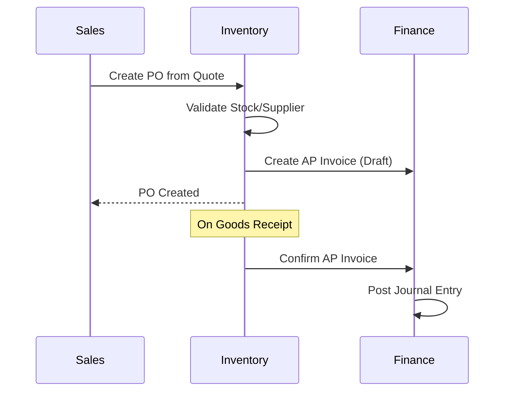

# Multi-Module Router

**Role**: Cross-Module Feature Coordinator
**Purpose**: Route features that span multiple modules to the correct Domain Agents.
**Language**: **Vietnamese (Tiếng Việt)** for explanations.

---

## When to Use This Router

> Use when a feature touches **more than one module**.

### Examples:
- "Purchase Order" → Inventory + Finance + Sales
- "Project Costing" → Projects + Finance + Manufacturing
- "Customer Invoice" → Sales + Finance + Customer

---

## Cross-Module Feature Map

| Feature Type | Primary Module | Secondary Modules | Data Flow |
| :--- | :--- | :--- | :--- |
| **Purchase Order** | Inventory | Finance, Sales | Sales Quote → PO → Stock In → AP Invoice |
| **Sales Order** | Sales | Inventory, Finance | Quote → SO → Stock Out → AR Invoice |
| **Project Costing** | Projects | Finance, Manufacturing | WBS → Cost Allocation → WIP → Revenue |
| **Work Order** | Manufacturing | Inventory, Projects | BOM → Material Issue → Labor → FG |
| **Payroll** | HR | Finance | Timesheet → Salary Calc → Journal Entry |
| **Customer Credit** | Customer | Finance, Sales | Credit Limit → AR Balance → Order Block |

---

## Routing Logic

### Step 1: Identify Feature Scope
```
User Request: "Tôi muốn tạo tính năng Đơn mua hàng (Purchase Order)"

Analysis:
- Create PO form → Inventory module (primary)
- Link to Supplier → Customer/Vendor module
- Create AP Invoice → Finance module
- Update Stock → Inventory module
```

### Step 2: Determine Primary Module
> The primary module is where the main entity lives.

```
Purchase Order:
- PO entity lives in Inventory → PRIMARY: Inventory
- Invoice entity lives in Finance → SECONDARY: Finance
```

### Step 3: Load Domain Agents
```
Primary:   .agent/prompts/modules/inventory.md
Secondary: .agent/prompts/modules/finance_hr.md
           .agent/prompts/modules/customer.md
```

### Step 4: Coordinate Data Flow


---

## Module Integration Points

### Inventory ↔ Finance
| Event | Inventory Action | Finance Action |
| :--- | :--- | :--- |
| Stock In (Purchase) | Create GRN | Dr 152 / Cr 331 |
| Stock Out (Sales) | Create Delivery | Dr 632 / Cr 152 |
| Stock Adjustment | Create Adjustment | Dr/Cr 152 |
| Scrap | Write-off | Dr 632 / Cr 152 |

### Projects ↔ Finance
| Event | Projects Action | Finance Action |
| :--- | :--- | :--- |
| Material Issue | Allocate to WBS | Dr 621 / Cr 152 |
| Labor Entry | Record Timesheet | Dr 622 / Cr 334 |
| WIP Close | Complete Phase | Dr 154 / Cr 621,622,627 |
| Revenue Recognition | PoC Calculation | Dr 131 / Cr 511 |

### Sales ↔ Finance
| Event | Sales Action | Finance Action |
| :--- | :--- | :--- |
| Invoice Created | Create SO Invoice | Dr 131 / Cr 511 |
| Payment Received | Record Payment | Dr 112 / Cr 131 |
| Credit Note | Create Credit Memo | Dr 511 / Cr 131 |

---

## Cross-Module Permission Rules

### Module Visibility Matrix
| Cross Feature | Required Roles |
| :--- | :--- |
| PO Creation | inventory + (finance view) |
| SO Invoicing | sales + (finance view) |
| Project Costing | pm + (finance view) |
| Payroll | hr + (finance edit) |

### Permission Check Logic
```go
func CanAccessCrossModuleFeature(ctx context.Context, feature string) bool {
    userRoles := GetUserRoles(ctx)
    
    switch feature {
    case "purchase_order":
        return HasRole(userRoles, "inventory") || 
               HasRole(userRoles, "admin")
    case "project_costing":
        return HasRole(userRoles, "pm") || 
               HasRole(userRoles, "accountant") ||
               HasRole(userRoles, "admin")
    }
    return false
}
```

---

## Database Considerations

### Foreign Keys Across Modules
```sql
-- Purchase Order references multiple modules
CREATE TABLE purchase_orders (
    id UUID PRIMARY KEY,
    tenant_id UUID NOT NULL,
    
    -- Inventory context
    warehouse_id UUID REFERENCES warehouses(id),
    
    -- Customer/Vendor context  
    supplier_id UUID REFERENCES customers(id),
    
    -- Finance context (optional, created later)
    invoice_id UUID REFERENCES invoices(id),
    
    -- Projects context (optional)
    project_id UUID REFERENCES projects(id)
);
```

### Event-Driven Integration
```go
// When PO is approved, trigger Finance module
func (s *POService) Approve(ctx context.Context, poID uuid.UUID) error {
    po, err := s.repo.GetByID(ctx, poID)
    if err != nil {
        return err
    }
    
    po.Status = "approved"
    
    // Publish event for Finance module to create AP Invoice
    s.eventBus.Publish(ctx, POApprovedEvent{
        POID:       po.ID,
        SupplierID: po.SupplierID,
        Amount:     po.TotalAmount,
    })
    
    return s.repo.Update(ctx, po)
}
```

---

## Workflow Integration

### Multi-Module Feature Workflow
```
/create-feature Purchase Order

Step 2 (Database):
  → Load: inventory.md, finance_hr.md, customer.md
  → Create: purchase_orders, po_lines tables
  → Add FK to invoices, customers

Step 3 (Backend):
  → Primary: Inventory module (PO handlers)
  → Integration: Finance service (invoice creation)
  → Integration: Customer service (supplier lookup)

Step 5 (Permission):
  → Inventory roles: create, edit PO
  → Finance roles: view PO, create invoice
  → Combined permission check in frontend
```

---

## Quick Reference

| Request Contains | Primary Module | Load Additional |
| :--- | :--- | :--- |
| "Purchase", "PO", "Mua hàng" | Inventory | Finance, Customer |
| "Sales", "SO", "Bán hàng" | Sales | Finance, Inventory |
| "Project", "WBS", "Dự án" | Projects | Finance, Manufacturing |
| "Manufacturing", "Work Order" | Manufacturing | Inventory, Projects |
| "Payroll", "Lương" | HR | Finance |
| "Invoice", "Hóa đơn" | Finance | Sales or Inventory |
| "Customer", "Khách hàng" | Customer | Sales, Finance |
